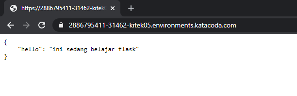

# KUBERNETES
Dalam hal ini kita menggunakan terminal yang memiliki fitur minikube di URL berikut.   
[https://kubernetes.io/docs/tutorials/hello-minikube/](https://kubernetes.io/docs/tutorials/hello-minikube/)

## Membuat image najib-flask

1. Membuat folder tempat aplikasi
```
$ mkdir najib-flask
$ cd najib-flask/
```
2. Membuat `app.py`  yaitu aplikasi simple untuk menampilkan **"hello": "ini sedang belajar flask"**
```
from flask import Flask
from flask_restful import Resource, Api

app = Flask(__name__)
api = Api(app)

class HelloWorld(Resource):
    def get(self):
        return {'hello': 'ini sedang belajar flask'}

api.add_resource(HelloWorld, '/')

if __name__ == '__main__':
    app.run(debug=True, host='0.0.0.0')
```

3. Membuat file `requirements.txt` yang berisi paket python yg digunakan.
```
flask  
flask_restful
```
4. Membuat `Dockerfile` yang akan menjadi image yang dibuat.
```
FROM python:2.7
COPY . /app
WORKDIR /app
RUN pip install -r requirements.txt
ENTRYPOINT ["python"]
CMD ["app.py"]
```
5. Struktur foldernya seperti ini.
```
najib-flask
│
└───requirements.txt
│
└───Dockerfile
│
└───app.py
```
6. Menjalakan `docker build` untuk membuat image 
```
$ docker build -t najibun/najib-flask:v1 .
Sending build context to Docker daemon  4.096kB
Step 1/6 : FROM python:2.7
2.7: Pulling from library/python
8f0fdd3eaac0: Pull complete
d918eaefd9de: Pull complete
43bf3e3107f5: Pull complete
27622921edb2: Pull complete
dcfa0aa1ae2c: Pull complete
ef6ca6913068: Pull complete
a755ea00feee: Pull complete
74b6f9ff9fd6: Pull complete
bebb4b693476: Pull complete
Digest: sha256:9517f5314968111658d229ed3038630a174e7a4f1b852bd185b70f614dffba08
Status: Downloaded newer image for python:2.7
 ---> 426ba9523d99
Step 2/6 : COPY . /app
 ---> ea68a91965a8
Step 3/6 : WORKDIR /app
 ---> Running in 6118dfb39520
Removing intermediate container 6118dfb39520
 ---> 6314972fb461
Step 4/6 : RUN pip install -r requirements.txt
 ---> Running in 8db465d9d731
DEPRECATION: Python 2.7 will reach the end of its life on January 1st, 2020. Please upgrade your Python as Python 2.7 won't be maintained after that date. A future version of pip will drop support for Python 2.7. More details about Python 2 support in pip, can be found at https://pip.pypa.io/en/latest/development/release-process/#python-2-support
Collecting flask
  Downloading https://files.pythonhosted.org/packages/9b/93/628509b8d5dc749656a9641f4caf13540e2cdec85276964ff8f43bbb1d3b/Flask-1.1.1-py2.py3-none-any.whl (94kB)
Collecting flask_restful
  Downloading https://files.pythonhosted.org/packages/17/44/6e490150ee443ca81d5f88b61bb4bbb133d44d75b0b716ebe92489508da4/Flask_RESTful-0.3.7-py2.py3-none-any.whl
Collecting itsdangerous>=0.24
  Downloading https://files.pythonhosted.org/packages/76/ae/44b03b253d6fade317f32c24d100b3b35c2239807046a4c953c7b89fa49e/itsdangerous-1.1.0-py2.py3-none-any.whl
Collecting Jinja2>=2.10.1
  Downloading https://files.pythonhosted.org/packages/65/e0/eb35e762802015cab1ccee04e8a277b03f1d8e53da3ec3106882ec42558b/Jinja2-2.10.3-py2.py3-none-any.whl (125kB)
Collecting click>=5.1
  Downloading https://files.pythonhosted.org/packages/fa/37/45185cb5abbc30d7257104c434fe0b07e5a195a6847506c074527aa599ec/Click-7.0-py2.py3-none-any.whl (81kB)
Collecting Werkzeug>=0.15
  Downloading https://files.pythonhosted.org/packages/ce/42/3aeda98f96e85fd26180534d36570e4d18108d62ae36f87694b476b83d6f/Werkzeug-0.16.0-py2.py3-none-any.whl (327kB)
Collecting aniso8601>=0.82
  Downloading https://files.pythonhosted.org/packages/eb/e4/787e104b58eadc1a710738d4e418d7e599e4e778e52cb8e5d5ef6ddd5833/aniso8601-8.0.0-py2.py3-none-any.whl (43kB)
Collecting pytz
  Downloading https://files.pythonhosted.org/packages/e7/f9/f0b53f88060247251bf481fa6ea62cd0d25bf1b11a87888e53ce5b7c8ad2/pytz-2019.3-py2.py3-none-any.whl (509kB)
Collecting six>=1.3.0
  Downloading https://files.pythonhosted.org/packages/65/26/32b8464df2a97e6dd1b656ed26b2c194606c16fe163c695a992b36c11cdf/six-1.13.0-py2.py3-none-any.whl
Collecting MarkupSafe>=0.23
  Downloading https://files.pythonhosted.org/packages/fb/40/f3adb7cf24a8012813c5edb20329eb22d5d8e2a0ecf73d21d6b85865da11/MarkupSafe-1.1.1-cp27-cp27mu-manylinux1_x86_64.whl
Installing collected packages: itsdangerous, MarkupSafe, Jinja2, click, Werkzeug, flask, aniso8601, pytz, six, flask-restful
Successfully installed Jinja2-2.10.3 MarkupSafe-1.1.1 Werkzeug-0.16.0 aniso8601-8.0.0 click-7.0 flask-1.1.1 flask-restful-0.3.7 itsdangerous-1.1.0 pytz-2019.3 six-1.13.0
Removing intermediate container 8db465d9d731
 ---> 93b67b2daf09
Step 5/6 : ENTRYPOINT ["python"]
 ---> Running in f279d8eef417
Removing intermediate container f279d8eef417
 ---> 23ebb1cfd318
Step 6/6 : CMD ["app.py"]
 ---> Running in c3b93bdb476b
Removing intermediate container c3b93bdb476b
 ---> 4d1dd1b457ca
Successfully built 4d1dd1b457ca
Successfully tagged najibun/najib-flask:v1
```
## Upload ke hub.docker.com
1. Login ke hub.docker.com dahulu
```
$ docker login
Login with your Docker ID to push and pull images from Docker Hub. If you don't have a Docker ID, head over to https://hub.docker.com to create one.
Username: najibun
Password:
WARNING! Your password will be stored unencrypted in /root/.docker/config.json.
Configure a credential helper to remove this warning. See
https://docs.docker.com/engine/reference/commandline/login/#credentials-store

Login Succeeded
```
2. Upload image yang kita buat tadi.
```
$ docker push najibun/najib-flask:v1
The push refers to repository [docker.io/najibun/najib-flask]
613bb191a9b4: Preparing
f8ad675fd41c: Preparing
613bb191a9b4: Pushed
03a3dc679282: Mounted from najibun/nflask
35fc403d4c4c: Mounted from najibun/nflask
c1fbc35a2660: Mounted from najibun/nflask
f63773c65620: Mounted from najibun/nflask
e6d60910d056: Mounted from najibun/nflask
b52c1c103fae: Mounted from najibun/nflask
6f1c84e6ec59: Pushed
dd5242c2dc8a: Pushed
v1: digest: sha256:400802a6961982452ecdef3d4cf2f59f00fa12064ff563d5c042f64e467bfab6 size: 2639
$
```
3. Hasilnya di lihat di docker hub   
**https://hub.docker.com/r/najibun/najib-flask**


## Membuat Deployment menggunakan image yang kita buat tadi
1. Membuat Deployment
```
$ kubectl create deployment najib-flask --image=najibun/najib-flask:v1
deployment.apps/najib-flask created
```
2. Melihat deployment yang berjalan
```
$ kubectl get deployments
NAME           READY   UP-TO-DATE   AVAILABLE   AGE
najib-flask   1/1     1            1           5m52s
```
3. Melihat pods yang berjalan pada deployment tersebut
```
$ kubectl get pods
NAME                           READY   STATUS             RESTARTS   AGE
najib-flask-695494c48-ln7zd   1/1     Running            0          5m24s
```
## Membuka port keluar
Secara default, Pod hanya bisa diakses melalui alamat IP internal di dalam cluster Kubernetes. Supaya Container python-flask bisa diakses dari luar jaringan virtual Kubernetes, saya harus ekspos Pod sebagai Service Kubernetes.   
1. Ekspos Pod pada internet publik menggunakan perintah `kubectl expose`  `--type-LoadBalancer` digunakan untuk ekspos Service keluar dari Cluster.
```
$ kubectl expose deployment najib-flask --type=LoadBalancer --port=5000
service/najib-flask exposed
```
2. Melihat Service yang telah dibuat
```
$ kubectl get services
NAME           TYPE           CLUSTER-IP     EXTERNAL-IP   PORT(S)          AGE
kubernetes     ClusterIP      10.96.0.1      <none>        443/TCP          39m
najib-flask   LoadBalancer   10.96.35.208   <pending>     5000:31462/TCP   13s
$
```
3. Buka dengan menggunakan port 31462 (dapat dilihat pada service).

